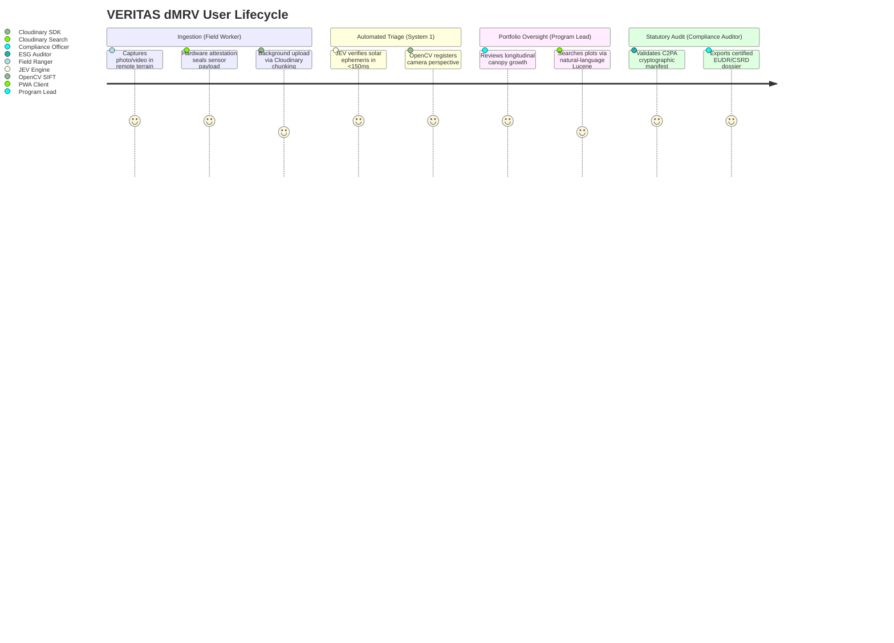

# Product Requirements Document (PRD)
## Project Name: VERITAS dMRV
**Platform:** AI-Powered Visual Ground-Truth & Cryptographic Media Intelligence Platform  
**Target:** Code Cubicle 6.0 — Problem Statement 02 (Cloudinary Ecosystem)  
**Standard Alignment:** EU CSRD (ESRS E1/E4), EUDR (Regulation 2023/1115), Verra VM0047, C2PA Standard  
**Document Status:** Approved & Baseline  
**Target Audience:** Engineering, Product, Design, and Executive Reviewers  

---

## 1. Executive Summary & Problem Space

### 1.1 The Market Paradox
The global voluntary carbon market (VCM) and corporate ESG compliance economy represent over **$40 Billion** in committed annual capital. However, international investigative audits in 2023–2024 revealed that upwards of **85% to 94% of nature-based carbon credits** were "phantom credits" lacking verified additionality or permanent biomass uplift.

Concurrently, legal frameworks have transitioned from voluntary public relations to high-liability statutory compliance:
* **EU Corporate Sustainability Reporting Directive (CSRD / ESRS E1 & E4):** Explicitly outlaws corporate "greenwashing" claims. Corporate climate disclosures require rigorous, third-party verifiable data chains.
* **EU Deforestation Regulation (EUDR):** Requires polygon-level geolocation and date-stamped land-use history to prove that commodities or restoration zones do not stem from recently deforested land. Fines for non-compliance reach up to **4% of annual EU turnover**.

### 1.2 The Root Cause: The Ground-Truth Void
1. **Satellite Blindspots:** Satellites cannot detect early-stage sapling mortality (Years 1–2), inspect underground drip irrigation, or verify water filtration equipment.
2. **Field Photo Chaos:** Ground proof resides on field workers' smartphones, but this media currently rots in disorganized WhatsApp threads and Google Drives with stripped EXIF and unverified origins.
3. **Forensic Vulnerability:** Photos are easily spoofed, recycled across different project plots, or generated using AI tools like Midjourney or Stable Diffusion.
4. **Audit Impossibility:** Third-party auditors (VVBs) take 6 to 18 months to manually sample sites, creating a massive, expensive administrative bottleneck.

### 1.3 The Solution Thesis
**VERITAS dMRV** is an enterprise-grade visual ground-truth intelligence platform. It ingests raw field media, uses **JEV (TypeSafe AI)** for sub-150ms anti-fraud triage, applies **OpenCV SIFT homography** to normalize shifting camera perspectives, extracts biological canopy metrics via the **shadow-invariant Green Leaf Index (GLI) with Otsu thresholding**, and leverages **Cloudinary** as an on-demand visual compute engine, structured metadata catalog, and C2PA cryptographic trust authority.

---

## 2. Product Goals & Non-Goals

### 2.1 Strategic Goals
* **G1 (Evidentiary Rigor):** Provide tamper-evident, cryptographically verified ground media with hardware attestation and astronomical shadow validation.
* **G2 (Scientific Change Quantification):** Replace subjective textual descriptions with mathematical vegetation canopy growth metrics ($2G - R - B$) across aligned longitudinal photos.
* **G3 (Sponsor Engine Depth):** Maximize Cloudinary native platform utilization (Structured Metadata Lucene search, dynamic chained URL transformations, AI Video Analysis visual transcription, and interactive video player hotspots).
* **G4 (Audit Automation):** Compress the statutory ESG audit dossier compilation cycle from 6 weeks of manual paperwork down to 60 seconds.

### 2.2 Explicit Non-Goals (Scope Boundary)
* **NG1 (No Hardware Manufacturing):** We do not build custom drone hardware or IoT camera traps; we provide software ingestion for existing commercial smartphones and standard drones.
* **NG2 (No Proprietary Carbon Tokenization):** We do not issue speculative cryptocurrency tokens; we generate compliance-ready audit dossiers mapped to established registries (Verra, Gold Standard) and EU statutory standards (CSRD, EUDR).
* **NG3 (No Full 3D Photogrammetric Mesh Generation):** We do not reconstruct dense 3D LiDAR point clouds; we focus on high-throughput planar homography ($3 \times 3$) and orthomosaic visual diffing optimized for edge delivery.

---

## 3. User Personas & User Journeys

### 3.1 Persona 1: Ground Field Ranger (Tariq)
* **Demographics:** 28, Forestry Technician, Kenya Wildlife / Reforestation Hub.
* **Constraints:** Operates in areas with 2G or zero cellular coverage; low-spec Android smartphone; harsh outdoor sun.
* **User Journey:**
  1. Opens VERITAS Progressive Web App (PWA) offline.
  2. Snaps photo of planting parcel. PWA captures compass heading, GPS coordinates, timestamp, and device attestation hash.
  3. App queues image in local IndexedDB. Upon detecting network connection, Cloudinary’s chunked uploader transmits media with automatic bandwidth tuning (`f_auto, q_auto:good`).

### 3.2 Persona 2: Project Operations Director (Elena)
* **Demographics:** 39, VP of Conservation Programs, Global Nature Enterprise.
* **Constraints:** Oversees 70 distributed restoration parcels across 4 continents; drowning in thousands of monthly photos.
* **User Journey:**
  1. Accesses VERITAS Enterprise Dashboard.
  2. Ingested media is automatically organized by Cadastral Project Polygon.
  3. Uses semantic search to locate milestones (*"Show mangrove plots in Sector 4 with canopy growth > 25%"*).
  4. Inspects registered before-and-after slider comparisons with verified SIFT homography alignment.

### 3.3 Persona 3: Institutional ESG Auditor & Carbon VVB (Dr. Thorne)
* **Demographics:** 47, Lead Assurance Partner, Sustainability & Climate Practice (Big 4 Accounting).
* **Constraints:** Legally accountable for verifying carbon credit claims under EU CSRD; zero tolerance for unverified claims or greenwashing.
* **User Journey:**
  1. Opens project audit URL.
  2. Validates C2PA cryptographic signature, confirming the asset was never edited or AI-generated.
  3. Reviews JEV RLCD decision logs (solar shadow angle match, pHash uniqueness).
  4. One-click exports an EUDR Article 9 cadastral dossier complete with QR provenance links to immutable master assets on Cloudinary CDN.

---

## 4. Functional Requirements (FRS)

### 4.1 Ingestion & Forensic Anti-Fraud Shield
* **FR-1.1:** The platform must ingest high-resolution JPEG/PNG images and MP4 drone footage via Cloudinary's signed upload pipeline.
* **FR-1.2:** The platform must calculate the astronomical solar azimuth and elevation based on reported UTC timestamp and GPS coordinates, rejecting assets where physical shadow orientation diverges by more than $\pm 12^\circ$.
* **FR-1.3:** The platform must compute a perceptual hash (pHash) upon ingestion to detect duplicate or recycled nursery photos across different project parcels.
* **FR-1.4:** The platform must integrate **JEV (TypeSafe AI)** to execute a sub-150ms System-1 triage evaluation, outputting typed decisions (`VERIFIED_PASS`, `REVIEW_AMBIGUOUS`, `QUARANTINE_FRAUD`) with calibrated Brier confidence scores.

### 4.2 Geometric Alignment & Ecological Metric Extraction
* **FR-2.1:** The platform must extract SIFT keypoints and 128-D descriptors from baseline ($T_1$) and progress ($T_2$) image pairs.
* **FR-2.2:** The platform must filter keypoints via Lowe's Ratio Test ($0.75$) and compute a $3 \times 3$ projective homography matrix using USAC_MAGSAC++.
* **FR-2.3:** The platform must warp the $T_2$ progress image to mathematically register into the geometric coordinate plane of the $T_1$ baseline anchor.
* **FR-2.4:** The platform must compute the **Green Leaf Index** $\text{GLI} = \dfrac{2G - R - B}{2G + R + B}$ across registered images and calculate net percentage canopy surface area growth, using Otsu adaptive thresholding.
  > **CORRECTION (v1.2.0).** This requirement previously specified the raw Excess Green Index $\text{ExG} = 2G - R - B$ with a fixed threshold. Raw ExG is **not shadow-invariant**: a cloud shadow depresses all three channels together, shifting the raw value and producing false canopy-mortality readings. The normalised GLI divides by the total intensity, isolating the *chromatic* foliage signal from the *luminance* drop, which is why the LLD (`03-SYSTEM-DESIGN` §3.2) and the mock server (`11`) already used GLI while this requirement, the `05-API-SPEC` response body, and the pitch script all still said ExG. GLI + Otsu is now the single standard across PRD, API, mock, and pitch.

### 4.3 Cloudinary Platform Integration
* **FR-3.1:** The platform must initialize an Admin Structured Metadata Schema on app bootstrap (`esg_project_id`, `cadastral_polygon`, `jev_triage_decision`, `canopy_delta_pct`, `c2pa_status`).
* **FR-3.2:** The platform must generate dynamic split-screen diff URLs on the fly using Cloudinary's functional transformation chain (`l_`, `c_crop`, `g_west/east`, `fl_layer_apply`).
* **FR-3.3:** The platform must integrate Cloudinary's AI Video Analysis API to generate timestamped visual transcriptions for silent drone footage.
* **FR-3.4:** The platform must embed the Cloudinary Interactive Video Player with clickable spatial hotspots displaying real-time telemetry metrics.

---

## 5. Non-Functional Requirements (NFRS)

* **NFR-1 (Performance & Latency):** System-1 forensic triage by JEV must respond in $< 150\text{ ms}$. OpenCV SIFT homography alignment must execute in $< 800\text{ ms}$ on 2K resolution imagery.
* **NFR-2 (Reliability & Offline-First):** Client-side PWA must allow capturing, geofencing, and queuing up to 500 photos in local IndexedDB without an active internet connection.
* **NFR-3 (Security & Trust):** All uploaded master assets must be anchored with an immutable SHA-256 hash and C2PA Content Credentials. Cloudinary delivery URLs must enforce HTTPS with optional HMAC-SHA256 signature tokens.
* **NFR-4 (Statutory Compliance):** All spatial data must conform to WGS84 GeoJSON closed polygon standards with 6 decimal places of precision, adhering to EUDR Article 9.

---

## 6. North Star Metric & Key Performance Indicators (KPIs)

* **North Star Metric:** **Automated Proof-of-Impact (PoI) Audit Velocity** — The percentage of field media assets automatically triaged, aligned, and certified without manual human intervention.
* **Secondary KPIs:**
  1. *False Positive Fraud Rate:* $< 0.5\%$ on synthetic/spoofed field photos.
  2. *SIFT Homography Registration Inlier Ratio:* $> 70\%$ on field image pairs within $30^\circ$ perspective variance.
  3. *Cloudinary CDN Cache Hit Ratio:* $> 92\%$ on dynamic before/after transformation URLs.
  4. *Audit Dossier Compilation Time:* $< 60\text{ seconds}$ from project milestone completion.

---

## 7. Risk Analysis & Mitigations

| Risk / Threat | Probability | Impact | Mitigation Strategy |
| :--- | :--- | :--- | :--- |
| **Severe 3D Parallax in Dense Forest** | Medium | High | Display Homography Inlier Ratio; if inlier confidence $< 60\%$, flag image for manual ground benchmark stake calibration. |
| **Cloudinary Video Processing Lag During Demo** | Medium | Critical | Implement the "Cooking Show Protocol": triage a live photo live on stage; serve pre-indexed 4K drone video for instantaneous hotspot playback. |
| **WhatsApp Media Metadata Stripping** | High | High | Partition ingestion tiers: WhatsApp is designated as Tier 0 (Unverified Community Alert); the VERITAS PWA is mandated for Tier 1 (C2PA Certified Audit Record). |
| **Solar Angle Discrepancy on Overcast Days** | Medium | Medium | When cloud cover obscures direct shadows, JEV automatically falls back to diffuse luminance variance and pHash deduplication. |

---

## 8. Enterprise STRIDE Security Threat Model & Cryptographic Trust Architecture

Derived from the formal security requirements framework, VERITAS dMRV mitigates all major threat vectors in digital MRV:

| Threat Category | Attack Vector | Technical Vulnerability | VERITAS Cryptographic Countermeasure |
| :--- | :--- | :--- | :--- |
| **Spoofing (Identity/Origin)** | Dishonest developer spoofs EXIF timestamp/GPS or uses stock nursery photos. | EXIF fields are client-mutable plaintext tags. | **1.** Astronomical solar ephemeris shadow angle verification ($\pm 12^\circ$ tolerance). **2.** Hardware-backed C2PA Content Credentials signed via device keystore (Secure Enclave). |
| **Tampering (Data/Media)** | Altering tree counts or photoshopping healthy greenery over dead saplings. | Compressed JPEG editing leaves subtle edge discontinuities. | **1.** 2D Fast Fourier Transform (FFT) grid checkerboard anomaly detection. **2.** High-frequency Laplacian noise variance ($< 80.0$ flagged as synthetic diffusion diffusion). |
| **Repudiation (Audit Trial)** | Carbon credit issuer denies issuing credits for failed forestry plots. | Centralized DB rows can be modified or deleted by admins. | **1.** Cryptographic Ed25519 signed decision receipts (`audit_receipt_id`). **2.** Immutable SHA-256 asset manifests pinned into Cloudinary Admin Structured Metadata. |
| **Information Disclosure** | Competitors scraping sensitive indigenous land tenure boundaries or proprietary agronomic IP. | Public open endpoints exposing cadastral polygons. | **1.** Signed Cloudinary delivery URLs (`s_...`). **2.** Role-Based Access Control (RBAC): Public sees certified canopy deltas; raw cadastral coordinates require Enterprise API auth. |
| **Denial of Service (DoS)** | Automated bots spamming heavy 4K drone video uploads to exhaust compute. | Unbounded video processing crashes backend worker threads. | **1.** Chunked direct uploads via Cloudinary signed upload presets (bypassing backend servers entirely). **2.** Rate-limiting at edge (FastAPI SlowAPI: 60 req/min). |
| **Elevation of Privilege** | Field ranger impersonating an accredited institutional VVB auditor. | Flat permission roles in API tokens. | **1.** JWT claims with strict RBAC scopes: `mrv:field_upload`, `mrv:triage_review`, `mrv:vvb_signoff`. |

---

## 9. Commercial Viability, Unit Economics & Market Go-To-Market (GTM)

### 9.1 The Urgent Market Tailwinds ($40B Problem)
* **EU Corporate Sustainability Reporting Directive (CSRD):** Mandates 50,000+ European enterprises to audit their Scope 3 upstream biodiversity and land-use impacts under ESRS E4.
* **EU Deforestation Regulation (EUDR):** Effective Dec 2024 / 2025, penalizing non-compliant commodity imports with fines up to **4% of annual EU turnover**.
* **Voluntary Carbon Market (VCM) Integrity Crisis:** Over $2B in phantom carbon credits exposed, forcing developers to adopt digital MRV (dMRV) with photographic ground-truth.

### 9.2 SaaS Monetization Architecture
1. **Tier 1: Developer Ingestion Tier (B2B SaaS):**
   * Flat subscription: **$1.20 / hectare / year** for continuous monitoring, drone analysis, and Cloudinary media intelligence.
   * *Customer Savings:* Replaces manual physical auditor site visits costing **$12.00–$18.00 / hectare / year** (an **85% operational cost reduction**).
2. **Tier 2: Institutional Assurance Tier (Pay-Per-Filing):**
   * **$250 per Statutory Audit Dossier Export** (pre-formatted for EUDR Article 9 and CSRD filing with verified Cloudinary C2PA provenance links).
3. **Enterprise Margin Mechanics:**
   * Compute cost per verification: ~$0.04 (Cloudinary edge transformations + lightweight Python SIFT/pvlib microservice).
   * Gross margin: **> 88%**, demonstrating venture-scale SaaS economics.

