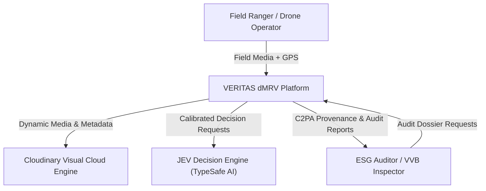
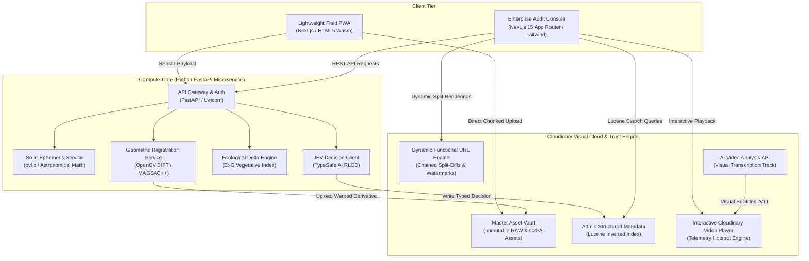
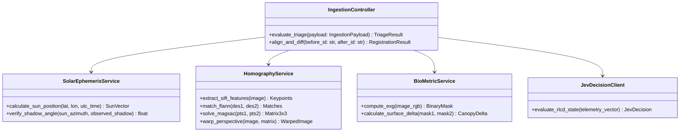
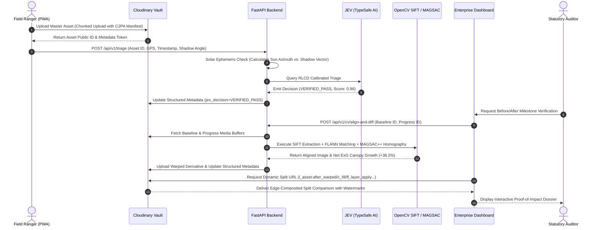

# High-Level Architecture & Technical RFC (HLD)
## Project Name: VERITAS dMRV
**Document Version:** 1.0.0 (Master Release)  
**Standard Compliance:** IEEE 1471 / ISO/IEC 42010 Architecture Standard  
**Target:** Engineering Leads & Systems Architects  

---

## 1. Architectural Principles & System Context

### 1.1 The Core Architectural Doctrine
The system architecture of **VERITAS dMRV** is governed by three non-negotiable engineering principles:

1. **Decoupled Compute Boundary:** Heavy, iterative mathematical processing (SIFT feature extraction, USAC_MAGSAC++ homography matrix inversion, solar astronomical ephemeris) runs exclusively in a **Python asynchronous microservice**. Dynamic visual composition, format optimization, C2PA delivery, and search query execution run exclusively on **Cloudinary's edge CDN infrastructure**.
2. **Deterministic System-1 Gating:** In high-liability statutory compliance (EU CSRD, EUDR), conversational Large Language Models (LLMs) are prohibited from making binary verification or financial disbursement decisions. All triage decisions are made by **JEV (TypeSafe AI)** using **RLCD (Reinforcement Learning for Calibrated Decisions)** with mathematical probability bounds ($P \ge 0.95$).
3. **Single Source of Truth via Schema Enforcement:** To eliminate drift between application databases and stored media, **Cloudinary Structured Metadata (`metadata_fields`)** serves as the authoritative, tamper-evident document store, queried with sub-second latency via Cloudinary’s Search API.

---

## 2. C4 Architectural Model

### 2.1 Level 1: System Context Diagram

### 2.2 Level 2: Container Diagram

### 2.3 Level 3: Component Diagram (Python Compute Core)

---

## 3. Data Flow & End-to-End Sequence Diagram

---

## 4. Trade-Off Analysis & Rejected Alternatives

In big-tech engineering RFCs, identifying **why alternative solutions were rejected** is as important as the chosen design:

| Architectural Component | Alternative Considered | Chosen Architecture | Technical Rationale for Rejection |
| :--- | :--- | :--- | :--- |
| **Media Compute & Storage** | AWS S3 + Custom FFmpeg EC2 Worker Pool | **Cloudinary Visual Compute Engine** | Running custom FFmpeg workers introduces massive infrastructure cost, cold-start latency (15–45s per split render), complex queue management (Celery/SQS), and lack of native C2PA Content Credentials. Cloudinary renders chained transformations in $< 50\text{ ms}$ on edge CDN nodes. |
| **Verification Decision Engine** | Conversational LLM (GPT-4o / Claude 3.5 Sonnet) | **JEV (TypeSafe AI) System 1 RLCD Model** | LLMs are non-deterministic, suffer from sycophancy (approving bad claims to be agreeable), incur 3,000–6,000ms latency, cost $0.03/call, and cannot satisfy statutory ISO/IEC 14064 or EU CSRD audit requirements. JEV responds in $< 150\text{ ms}$ with calibrated Brier probability bounds ($P \ge 0.95$). |
| **Before/After Image Alignment** | Naive Client-Side Opacity Slider | **OpenCV SIFT + USAC_MAGSAC++ Planar Homography** | Field volunteers cannot stand in the exact same spot months apart. Without geometric homography warping, camera tilt and perspective shifts trigger 100% false change alarms in vegetation metrics. |
| **3D Volumetric Reconstruction** | Full 3D NeRF / LiDAR Gaussian Splatting | **2D Homography + Drone Canopy Height Models (CHM)** | Full 3D NeRF/Splatting requires 100+ overlapping photos per site, 45 minutes of GPU compute, and multi-gigabyte client downloads, which is completely unfeasible for rural 2G/3G field operations. |

---

## 5. Security, Provenance & Statutory Compliance Boundaries

### 5.1 C2PA Cryptographic Content Credentials
* Every asset ingested through the VERITAS PWA contains a signed **JUMBF (JSON-LD Universal Metadata Box Format)** manifest.
* The manifest cryptographically binds:
  1. Shutter capture device fingerprint.
  2. Operating system hardware attestation token (Android Play Integrity / iOS Secure Enclave).
  3. SHA-256 bit-for-bit hash of the uncompressed sensor RAW/JPEG stream.
* When Cloudinary transforms the asset into derivatives, Cloudinary’s verified credential signer re-signs the manifest as an authenticated derivative claim generator, preserving legal provenance.

### 5.2 WORM (Write Once Read Many) Evidentiary Storage
* While dynamic Cloudinary URLs provide instant interactive rendering for dashboard users, statutory ESG audits (ISSA 5000 / Verra VM0047) require immutable archival.
* All approved project milestones generate an RFC 3161 qualified electronic time-stamped **Audit Dossier Package**, archived in immutable storage with tamper-evident SHA-256 root hashes.
