# Work Breakdown Structure & Sprint Project Plan (Project Plan)
## Project Name: VERITAS dMRV
**Document Version:** 1.0.0 (Generated via Project Planner Skill)  
**Target:** Engineering Team Leads & Sprint Planners  
**Total Estimated Effort:** 36–48 Person-Hours (Optimized for 48-Hour Hackathon Delivery)  

---

## 1. Project Goal & Definition of Done

### 1.1 Ultimate Goal
Deliver an end-to-end, production-grade deployment of **VERITAS dMRV** for Code Cubicle 6.0:
1. Field media upload with automated solar ephemeris and JEV RLCD triage ($<150\text{ms}$).
2. OpenCV SIFT + MAGSAC++ homography alignment and ExG canopy growth extraction.
3. Cloudinary dynamic split-screen URL rendering and C2PA Content Credentials.
4. Interactive video player with clickable drone telemetry hotspots.
5. Single-click statutory EUDR/CSRD compliance audit dossier export.

### 1.2 Definition of "Done"
* [ ] Schema initialized in Cloudinary via Admin API (`metadata_fields`).
* [ ] Python FastAPI microservice passing all automated tests (solar physics, homography, GLI canopy delta).
* [ ] Next.js 15 frontend rendering interactive split-slider and video hotspots with zero CORS or hydration errors.
* [ ] Live 180-second pitch demo rehearsed and verified with fail-safe demo fallbacks.

> **CORRECTION (v1.2.0).** These four boxes were pre-checked `[x]` in a plan
> document authored *before* any implementation existed. A checklist that starts
> complete carries no signal and cannot be used to gate anything. All reset to
> `[ ]`.
>
> **Scope gap also recorded:** roughly half the system specified across `docs/`
> does not appear in the WBS below — SAM segmentation (M4), allometric biomass
> and the VM0047 discount (M5/M5b), synthetic/Moiré detection (M6), the EUDR
> Article 9 validator (M7), the offline PWA and service worker, the gyroscopic
> leveler, the Forensic Physics HUD, Docker Compose, the mock server, the
> four-tier test suites, and CI. The mock server in particular is the artifact
> that unblocks the whole team at hour zero and was not on the critical path at
> all. See `EXECUTION-PLAN.md` §11 for the corrected, rubric-first sequencing.

---

## 2. Work Breakdown Structure (WBS) & Task Matrix

```mermaid
gantt
    title VERITAS dMRV 48-Hour Hackathon Sprint Plan
    dateFormat  X
    axisFormat Hour %s

    section Phase 1: Foundation
    Setup Cloudinary Schema & Config     :p1_1, 0, 4
    FastAPI Backend Scaffolding          :p1_2, 2, 6
    Next.js 15 UI Scaffolding            :p1_3, 2, 6

    section Phase 2: Compute Core
    Solar Ephemeris & pHash Service      :p2_1, 6, 12
    OpenCV SIFT/MAGSAC Homography        :p2_2, 8, 16
    ExG Canopy Delta & JEV Triage        :p2_3, 12, 18

    section Phase 3: Visual & Media
    Cloudinary Dynamic Split URL Engine  :p3_1, 16, 22
    Interactive Hotspot Video Player     :p3_2, 18, 26
    React Compare Slider UI Component    :p3_3, 20, 26

    section Phase 4: Audit & Polish
    EUDR/CSRD Audit Dossier Generator    :p4_1, 26, 32
    E2E Integration & Demo Cache Mode    :p4_2, 32, 38
    Pitch Deck & 180s Rehearsal          :p4_3, 38, 44
```



---

## 3. Detailed Task Specifications

### Phase 1: Architecture & Foundation (Hours 0 – 6)

#### Task 1.1: Cloudinary Admin Schema & Presets Initialization
* **Estimated Time:** 3 Hours
* **Inputs:** Cloudinary API Credentials (`cloud_name`, `api_key`, `api_secret`).
* **Deliverable:** Automated script (`scripts/init_cloudinary_schema.ts`) creating account-level `metadata_fields` (`esg_project_id`, `jev_triage_decision`, `canopy_delta_pct`, `c2pa_status`).
* **Done Criteria:** Script executes cleanly, and fields appear in Cloudinary Management Console.

#### Task 1.2: FastAPI Backend Scaffolding
* **Estimated Time:** 3 Hours
* **Inputs:** Python 3.12 environment, `requirements.txt`.
* **Deliverable:** Modular FastAPI structure (`api/v1/routes`, `services/`, `models/`, `core/`).
* **Done Criteria:** `GET /health` returns `{ "status": "UP", "engine": "VERITAS_CORE" }`.

#### Task 1.3: Next.js 15 Dark-Mode Shell Scaffolding
* **Estimated Time:** 3 Hours
* **Inputs:** Next.js 15, Tailwind CSS, Lucide Icons.
* **Deliverable:** Root App Router layout with responsive header, status HUD, and tab navigation.
* **Done Criteria:** App builds cleanly with `npm run build` without hydration warnings.

---

### Phase 2: Mathematical & Computer Vision Core (Hours 6 – 18)

#### Task 2.1: Solar-Ephemeris Astronomical Verification Service
* **Estimated Time:** 4 Hours
* **Inputs:** UTC timestamp, GPS coordinates, observed shadow angle.
* **Deliverable:** Python service (`services/solar_service.py`) using `pvlib` with float boundary clipping.
* **Done Criteria:** Unit test verifies that legitimate photo passes ($\Delta \theta \le 12^\circ$) and spoofed photo fails ($\Delta \theta > 12^\circ$).

#### Task 2.2: OpenCV SIFT + USAC_MAGSAC++ Registration Engine
* **Estimated Time:** 6 Hours (Critical Path)
* **Inputs:** Baseline image buffer ($T_1$), Progress image buffer ($T_2$).
* **Deliverable:** Service (`services/homography_service.py`) outputting warped $T_2$ and inlier ratio.
* **Done Criteria:** Rotated/tilted test photo registers with inlier ratio $> 70\%$ in $< 800\text{ms}$.

#### Task 2.3: Excess Green Index (ExG) & JEV RLCD Decision Engine
* **Estimated Time:** 4 Hours
* **Inputs:** Aligned image pair, SIFT inlier ratio, solar error.
* **Deliverable:** Service (`services/jev_service.py`) calculating biological canopy area change ($\Delta C$) and emitting typed JEV decision.
* **Done Criteria:** Outputs calibrated Brier confidence score ($0.96$) and canopy delta percentage.

---

### Phase 3: Cloudinary Edge Visual Compute & Frontend UI (Hours 18 – 28)

#### Task 3.1: Cloudinary Dynamic URL Split-Screen Generator
* **Estimated Time:** 3 Hours
* **Inputs:** Baseline Public ID, Warped Public ID, Metric Text.
* **Deliverable:** Functional URL builder (`lib/cloudinary-urls.ts`) chaining `c_crop`, `g_west/east`, and `l_text`.
* **Done Criteria:** Generated URL loads instant side-by-side comparison on Cloudinary CDN in $< 50\text{ms}$.

#### Task 3.2: Cloudinary Interactive Hotspot Video Player
* **Estimated Time:** 4 Hours (Critical Path)
* **Inputs:** Cloudinary Video Player CDN bundle, 4K Drone test video, VTT visual subtitle track.
* **Deliverable:** React component (`components/HotspotVideoPlayer.tsx`) displaying interactive clickable telemetry hotspots over moving drone footage.
* **Done Criteria:** Clicking the on-screen canopy hotspot opens the verified species and C2PA telemetry modal.

#### Task 3.3: Interactive Before/After Split Slider (`react-compare-slider`)
* **Estimated Time:** 3 Hours
* **Inputs:** Baseline URL, Warped Progress URL.
* **Deliverable:** Component (`components/ProofOfImpactStudio.tsx`) allowing smooth drag comparisons.
* **Done Criteria:** Drag handle operates at 60 FPS without layout shift.

---

### Phase 4: Compliance Export, E2E Integration & Demo Rehearsal (Hours 28 – 44)

#### Task 4.1: Statutory EUDR/CSRD Audit Dossier Generator
* **Estimated Time:** 4 Hours
* **Inputs:** Project ID, cadastral GeoJSON polygon, verified milestone metrics.
* **Deliverable:** Endpoint and UI modal generating compliance report with QR links to signed master assets.
* **Done Criteria:** One-click download produces valid, print-ready audit dossier.

#### Task 4.2: End-to-End Integration & Demo Cache Mode
* **Estimated Time:** 4 Hours
* **Inputs:** All completed backend and frontend modules.
* **Deliverable:** End-to-end integration test + **Demo Cache Toggle Switch** for offline fail-safe presentation.
* **Done Criteria:** Entire user flow executes smoothly from drag-and-drop upload to audit dossier export.

#### Task 4.3: 180-Second Live Stage Rehearsal & Pitch Polish
* **Estimated Time:** 4 Hours
* **Inputs:** Presentation script from `docs/07-RUNBOOK.md`.
* **Deliverable:** 3 recorded dry-runs timed to exactly 175 seconds.
* **Done Criteria:** Presenter hits every cue (Solar fraud catch, SIFT split-diff, video hotspot) with zero dead air.

---

## 4. Critical Path & Dependency Management

```
Critical Path:
[Task 1.1: Schema Setup] ──▶ [Task 2.2: SIFT Homography] ──▶ [Task 3.1: URL Split Generator] ──▶ [Task 3.2: Video Hotspots] ──▶ [Task 4.2: Integration] ──▶ [Task 4.3: 180s Pitch]
```

### Risk & Buffer Management
* **Total Buffer:** 8 Hours built into the final 48-hour window.
* **Contingency Strategy:** If SIFT homography tuning encounters unexpected drone perspective distortion, fallback to pre-computed homography matrices while keeping live JEV solar-triage running in real-time.
