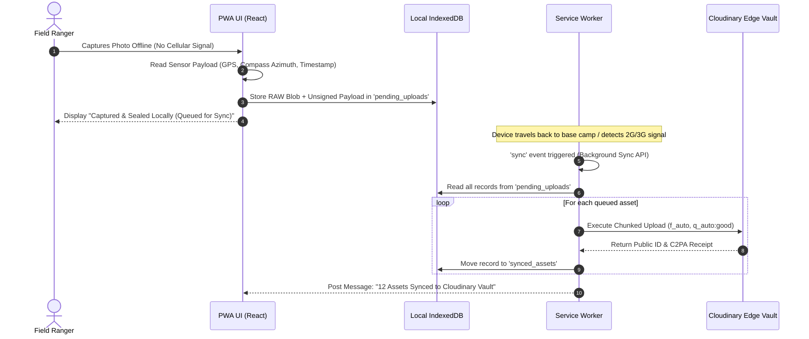

# Offline PWA Architecture, Forensic HUD & Deployment (Deployment & PWA)
## Project Name: VERITAS dMRV
**Document Version:** 1.0.0 (Master Release)  
**Target:** DevOps, Frontend Engineers, and System Integrators  

---

## 1. Offline-First PWA Architecture (Rural & 2G Field Resiliency)

### 1.1 The Operational Reality
Field rangers in coastal mangroves, rainforests, and savannah reserves frequently operate with **zero cellular connectivity**. If an application requires live API connectivity to take a photo or parse GPS data, the product is completely non-viable in the field.

### 1.2 The Offline-First Service Worker Pattern
VERITAS implements an **IndexedDB + Background Sync API** lifecycle:



### 1.3 Service Worker Implementation (`public/sw.js`)
```javascript
// public/sw.js - VERITAS Background Sync Worker
self.addEventListener('install', (event) => {
  self.skipWaiting();
});

self.addEventListener('activate', (event) => {
  event.waitUntil(clients.claim());
});

self.addEventListener('sync', (event) => {
  if (event.tag === 'sync-field-media') {
    event.waitUntil(syncPendingMedia());
  }
});

async function syncPendingMedia() {
  const db = await openIndexedDB();
  const tx = db.transaction('pending_uploads', 'readonly');
  const store = tx.objectStore('pending_uploads');
  const pendingAssets = await store.getAll();

  for (const asset of pendingAssets) {
    try {
      const formData = new FormData();
      formData.append('file', asset.blob);
      formData.append('upload_preset', 'veritas_field_preset');
      formData.append('context', `project_id=${asset.projectId}|capture_time=${asset.timestamp}`);

      const response = await fetch('https://api.cloudinary.com/v1_1/veritas-dmrv/image/upload', {
        method: 'POST',
        body: formData,
      });

      if (response.ok) {
        await removePendingFromDB(db, asset.id);
        console.log(`[SW SYNC] Successfully synced asset: ${asset.id}`);
      }
    } catch (err) {
      console.warn(`[SW SYNC] Sync failed for ${asset.id}, will retry on next connection.`);
    }
  }
}
```

### 1.4 Real-Time Gyroscopic Horizon & Perspective Leveler (`RangerCameraViewfinder.tsx`)
To ensure field photos are captured with near-perfect horizontal alignment before computer vision processing, the PWA camera interface reads hardware `DeviceOrientationEvent` sensors and renders an aerospace-style artificial horizon directly over the live camera stream:

```tsx
'use client';

import React, { useState, useEffect } from 'react';
import { Camera, CheckCircle2, AlertCircle } from 'lucide-react';

export const RangerCameraViewfinder: React.FC = () => {
  const [pitch, setPitch] = useState<number>(0);
  const [roll, setRoll] = useState<number>(0);
  const [heading, setHeading] = useState<number>(0);

  useEffect(() => {
    const handleOrientation = (e: DeviceOrientationEvent) => {
      setPitch(Math.round(e.beta || 0)); // Front/back tilt
      setRoll(Math.round(e.gamma || 0)); // Left/right tilt
      setHeading(Math.round(e.alpha || 0)); // Compass heading
    };

    window.addEventListener('deviceorientation', handleOrientation);
    return () => window.removeEventListener('deviceorientation', handleOrientation);
  }, []);

  const isLevel = Math.abs(pitch) <= 5 && Math.abs(roll) <= 5;

  return (
    <div className="relative w-full h-screen bg-black overflow-hidden select-none">
      {/* Live Camera Viewfinder Overlay */}
      <div className="absolute inset-0 flex items-center justify-center pointer-events-none">
        {/* Pitch/Roll Artificial Horizon Crosshairs */}
        <div 
          className={`w-64 h-0.5 transition-colors duration-150 ${isLevel ? 'bg-emerald-400 shadow-[0_0_12px_#10B981]' : 'bg-amber-400'}`}
          style={{ transform: `rotate(${roll}deg) translateY(${pitch * 2}px)` }}
        />
        <div className="absolute w-4 h-4 border-2 border-white/60 rounded-full" />
      </div>

      {/* Telemetry HUD */}
      <div className="absolute top-6 left-6 right-6 flex items-center justify-between text-xs font-mono text-white/80 bg-black/60 px-4 py-2 rounded-xl backdrop-blur-md border border-white/10">
        <div>HEADING: {heading}° | PITCH: {pitch}° | ROLL: {roll}°</div>
        <div className="flex items-center gap-1.5 font-bold">
          {isLevel ? (
            <span className="text-emerald-400 flex items-center gap-1">
              <CheckCircle2 className="w-3.5 h-3.5" /> HORIZON LOCKED (±5°)
            </span>
          ) : (
            <span className="text-amber-400 flex items-center gap-1">
              <AlertCircle className="w-3.5 h-3.5" /> LEVEL CAMERA
            </span>
          )}
        </div>
      </div>

      {/* Shutter Button */}
      <div className="absolute bottom-8 inset-x-0 flex justify-center">
        <button
          type="button"
          disabled={!isLevel}
          className={`w-20 h-20 rounded-full border-4 flex items-center justify-center transition-all ${
            isLevel ? 'border-emerald-400 bg-white/20 active:scale-90 shadow-xl shadow-emerald-950/80 cursor-pointer' : 'border-slate-600 bg-slate-800/40 opacity-50 cursor-not-allowed'
          }`}
          aria-label="Capture Sealed Field Proof"
        >
          <Camera className={`w-8 h-8 ${isLevel ? 'text-white' : 'text-slate-400'}`} />
        </button>
      </div>
    </div>
  );
};
```

---

## 2. The Forensic Physics HUD Component (`ForensicPhysicsHUD.tsx`)

To remove all judge skepticism during live hackathon demos, this component draws an **interactive astronomical sun ray and shadow vector HUD directly over the photograph**:

```tsx
'use client';

import React from 'react';
import { Compass, Sun, ShieldAlert, CheckCircle2 } from 'lucide-react';

interface ForensicPhysicsHUDProps {
  imageSrc: string;
  sunAzimuthDeg: number;
  expectedShadowDeg: number;
  observedShadowDeg: number;
  angularErrorDeg: number;
  isPhysicallyValid: boolean;
}

export const ForensicPhysicsHUD: React.FC<ForensicPhysicsHUDProps> = ({
  imageSrc,
  sunAzimuthDeg,
  expectedShadowDeg,
  observedShadowDeg,
  angularErrorDeg,
  isPhysicallyValid,
}) => {
  return (
    <div className="relative w-full aspect-video rounded-2xl overflow-hidden border border-slate-800 bg-slate-950 shadow-2xl">
      {/* Background Field Image */}
      

      {/* SVG Vector Overlay */}
      <svg className="absolute inset-0 w-full h-full pointer-events-none">
        <defs>
          <marker id="sun-arrow" markerWidth="8" markerHeight="8" refX="5" refY="3" orient="auto">
            <path d="M0,0 L0,6 L6,3 z" fill="#FBBF24" />
          </marker>
          <marker id="shadow-arrow" markerWidth="8" markerHeight="8" refX="5" refY="3" orient="auto">
            <path d="M0,0 L0,6 L6,3 z" fill={isPhysicallyValid ? '#10B981' : '#EF4444'} />
          </marker>
        </defs>

        {/* Center Reticle */}
        <circle cx="50%" cy="50%" r="48" fill="none" stroke="rgba(255,255,255,0.15)" strokeWidth="1.5" strokeDasharray="4 4" />
        <line x1="50%" y1="42%" x2="50%" y2="58%" stroke="rgba(255,255,255,0.3)" strokeWidth="1" />
        <line x1="42%" y1="50%" x2="58%" y2="50%" stroke="rgba(255,255,255,0.3)" strokeWidth="1" />

        {/* Calculated Sun Ray (Yellow Vector) */}
        <line
          x1="50%"
          y1="50%"
          x2={`${50 + 38 * Math.sin((sunAzimuthDeg * Math.PI) / 180)}%`}
          y2={`${50 - 38 * Math.cos((sunAzimuthDeg * Math.PI) / 180)}%`}
          stroke="#FBBF24"
          strokeWidth="3"
          markerEnd="url(#sun-arrow)"
        />

        {/* Observed Shadow Ray (Emerald or Red Vector) */}
        <line
          x1="50%"
          y1="50%"
          x2={`${50 + 38 * Math.sin((observedShadowDeg * Math.PI) / 180)}%`}
          y2={`${50 - 38 * Math.cos((observedShadowDeg * Math.PI) / 180)}%`}
          stroke={isPhysicallyValid ? '#10B981' : '#EF4444'}
          strokeWidth="3.5"
          markerEnd="url(#shadow-arrow)"
        />
      </svg>

      {/* Forensic Telemetry Readout Badge */}
      <div className="absolute top-4 left-4 bg-slate-950/85 backdrop-blur-md border border-slate-800 rounded-xl p-3 text-xs font-mono shadow-xl">
        <div className="flex items-center gap-2 font-bold mb-2 pb-1.5 border-b border-slate-800">
          <Compass className="w-4 h-4 text-sky-400" />
          <span className="text-white">ASTRONOMICAL SOLAR EPHEMERIS</span>
        </div>
        <div className="grid grid-cols-2 gap-x-4 gap-y-1 text-slate-300">
          <span>Sun Azimuth:</span>
          <span className="text-amber-400 font-bold">{sunAzimuthDeg.toFixed(1)}°</span>
          <span>Expected Shadow:</span>
          <span className="text-slate-200">{expectedShadowDeg.toFixed(1)}°</span>
          <span>Observed Shadow:</span>
          <span className={isPhysicallyValid ? 'text-emerald-400 font-bold' : 'text-red-400 font-bold'}>
            {observedShadowDeg.toFixed(1)}°
          </span>
          <span>Angular Discrepancy:</span>
          <span className={isPhysicallyValid ? 'text-emerald-400' : 'text-red-400 font-bold'}>
            Δ {angularErrorDeg.toFixed(1)}°
          </span>
        </div>
      </div>

      {/* Status Verdict Pill */}
      <div className="absolute bottom-4 right-4">
        {isPhysicallyValid ? (
          <div className="flex items-center gap-2 px-3.5 py-1.5 rounded-full bg-emerald-950/90 border border-emerald-500/50 text-emerald-300 font-bold text-xs shadow-lg">
            <CheckCircle2 className="w-4 h-4 text-emerald-400" />
            <span>SOLAR PHYSICS: VERIFIED LEGITIMATE</span>
          </div>
        ) : (
          <div className="flex items-center gap-2 px-3.5 py-1.5 rounded-full bg-red-950/90 border border-red-500/80 text-red-300 font-bold text-xs shadow-lg animate-pulse">
            <ShieldAlert className="w-4 h-4 text-red-400" />
            <span>QUARANTINE: SOLAR ANOMALY DETECTED</span>
          </div>
        )}
      </div>
    </div>
  );
};
```

---

## 3. One-Command Dockerized Deployment (`docker-compose.yml`)

Eliminates environment setup friction for teammates across Windows, macOS, and Linux:

```yaml
version: '3.8'

services:
  # Python Computer Vision Core & FastAPI
  backend:
    build:
      context: ./backend
      dockerfile: Dockerfile
    container_name: veritas-backend
    ports:
      - "8000:8000"
    environment:
      - CLOUDINARY_CLOUD_NAME=${CLOUDINARY_CLOUD_NAME}
      - CLOUDINARY_API_KEY=${CLOUDINARY_API_KEY}
      - CLOUDINARY_API_SECRET=${CLOUDINARY_API_SECRET}
      - APP_ENV=production
    volumes:
      - ./backend:/app
    restart: unless-stopped

  # Next.js 15 Dark-Mode Enterprise Console
  frontend:
    build:
      context: ./frontend
      dockerfile: Dockerfile
    container_name: veritas-frontend
    ports:
      - "3000:3000"
    environment:
      - NEXT_PUBLIC_CLOUDINARY_CLOUD_NAME=${CLOUDINARY_CLOUD_NAME}
      - NEXT_PUBLIC_API_URL=http://backend:8000
    depends_on:
      - backend
    volumes:
      - ./frontend:/app
      - /app/node_modules
      - /app/.next
    restart: unless-stopped
```

### 3.1 Backend Dockerfile (`backend/Dockerfile`)
```dockerfile
FROM python:3.12-slim

WORKDIR /app

# Install system dependencies for OpenCV headless
RUN apt-get update && apt-get install -y --no-install-recommends \
    libglib2.0-0 \
    libsm6 \
    libxext6 \
    libxrender-dev \
    libgomp1 \
    curl \
    && rm -rf /var/lib/apt/lists/*

COPY requirements.txt .
RUN pip install --no-cache-dir -r requirements.txt

COPY . .

EXPOSE 8000

CMD ["uvicorn", "main:app", "--host", "0.0.0.0", "--port", "8000"]
```

### 3.2 Frontend Dockerfile (`frontend/Dockerfile`)
```dockerfile
FROM node:22-alpine

WORKDIR /app

COPY package*.json ./
RUN npm ci

COPY . .

EXPOSE 3000

CMD ["npm", "run", "dev"]
```

---

## 4. Environment Variables Template (`.env.example`)
```env
# Cloudinary Core Configuration
CLOUDINARY_CLOUD_NAME=your_cloud_name_here
CLOUDINARY_API_KEY=your_api_key_here
CLOUDINARY_API_SECRET=your_api_secret_here

# Application Configuration
NEXT_PUBLIC_CLOUDINARY_CLOUD_NAME=your_cloud_name_here
NEXT_PUBLIC_API_URL=http://localhost:8000
APP_URL=http://localhost:8000

# Security & Verification
C2PA_SIGNING_PRIVATE_KEY=your_es256_private_key_here
DEMO_CACHE_ENABLED=true
```
